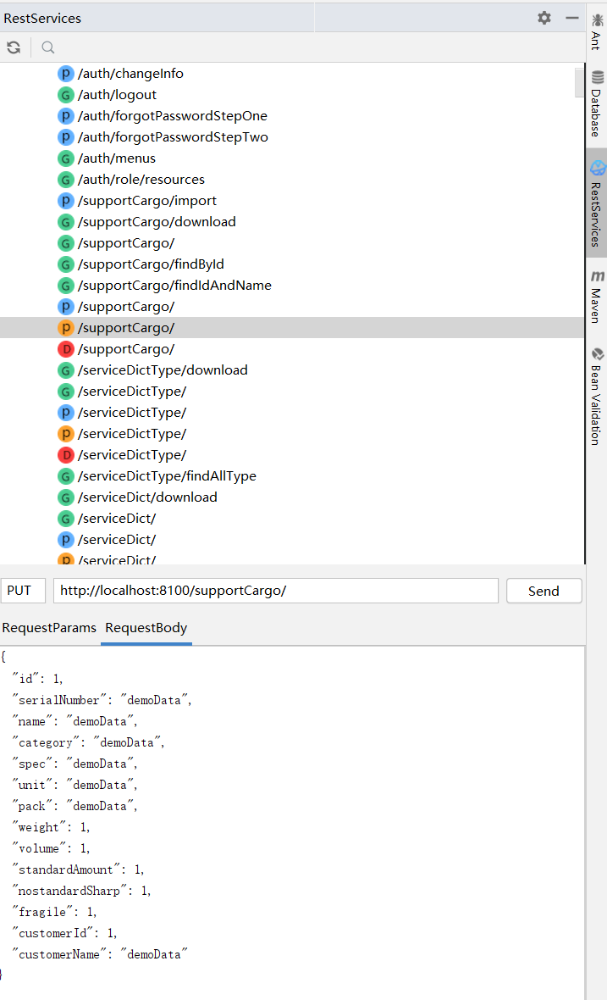

# Restful Toolkit For Intellij IDEA

## Feature list

- [x] Base on [IntelliJ Platform Plugin Template][template], support Java 8+, IDEA 2020.2+.
- [x] Enter the URL to navigate to service declaration. ( use: Ctrl + \ or Ctrl + Alt + N ) .
- [x] Show Restful services structure.
- [x] A simple http request tool.
- [x] Generate&Copy Query Param, Generate&Copy URL on the request method.
- [x] Convert java class to JSON; format json data <em>( Windows: Ctrl + Enter; Mac: Command + Enter ) .
- [ ] Other useful features, Stay tuned... ^_^

Quick Search Service Preview

RestService Window Preview

## Installation

- Using IDE built-in plugin system:

  <kbd>Settings/Preferences</kbd> > <kbd>Plugins</kbd> > <kbd>Marketplace</kbd> > <kbd>Search for "
  RestfulToolkit"</kbd> >
  <kbd>Install Plugin</kbd>

- Manually:

  Download the [latest release](https://github.com/huangbaihua001/restful-toolkit/releases/latest) and install it
  manually using
  <kbd>Settings/Preferences</kbd> > <kbd>Plugins</kbd> > <kbd>⚙️</kbd> > <kbd>Install plugin from disk...</kbd>

---
Plugin based on the [IntelliJ Platform Plugin Template][template], [RestfulToolkit][RestfulToolkit]

[template]: https://github.com/JetBrains/intellij-platform-plugin-template

[RestfulToolkit]: https://github.com/mrmanzhaow/RestfulToolkit
