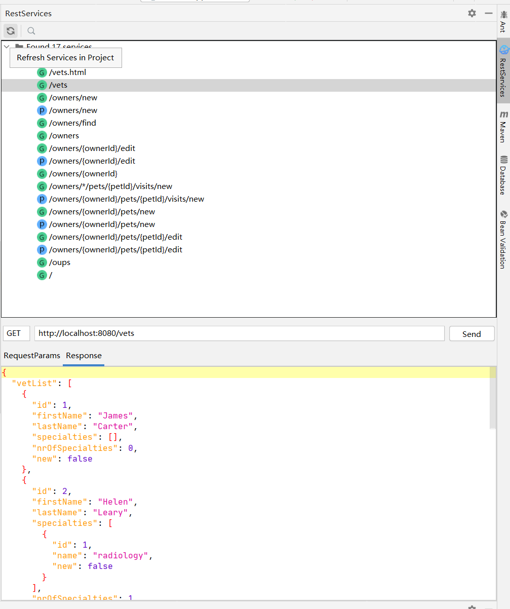
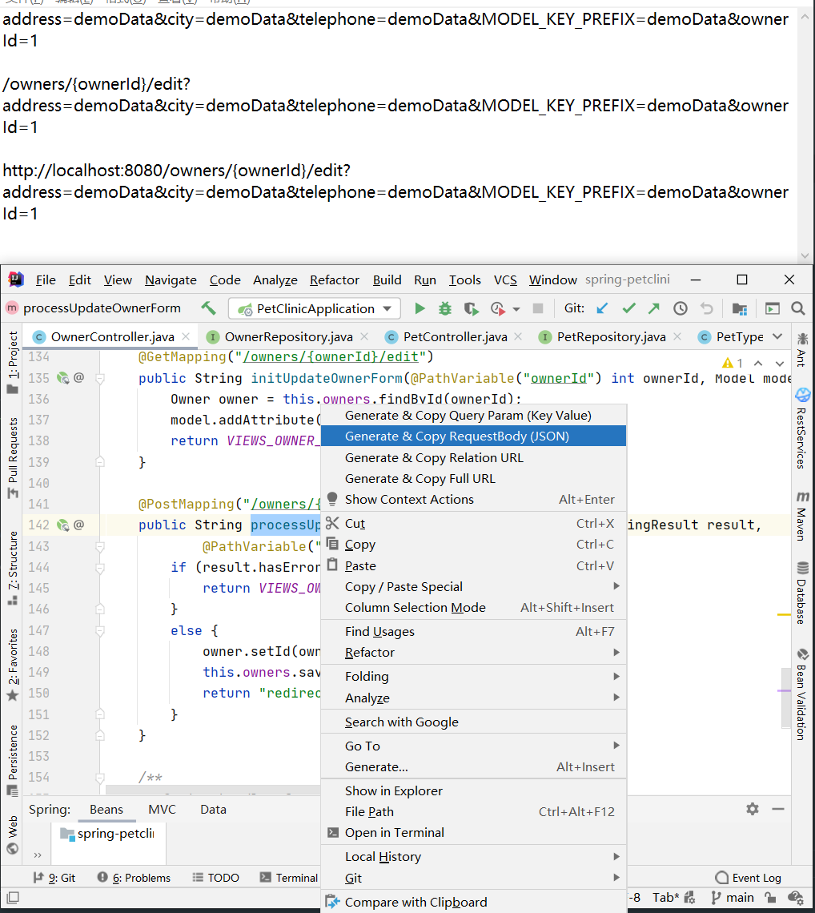
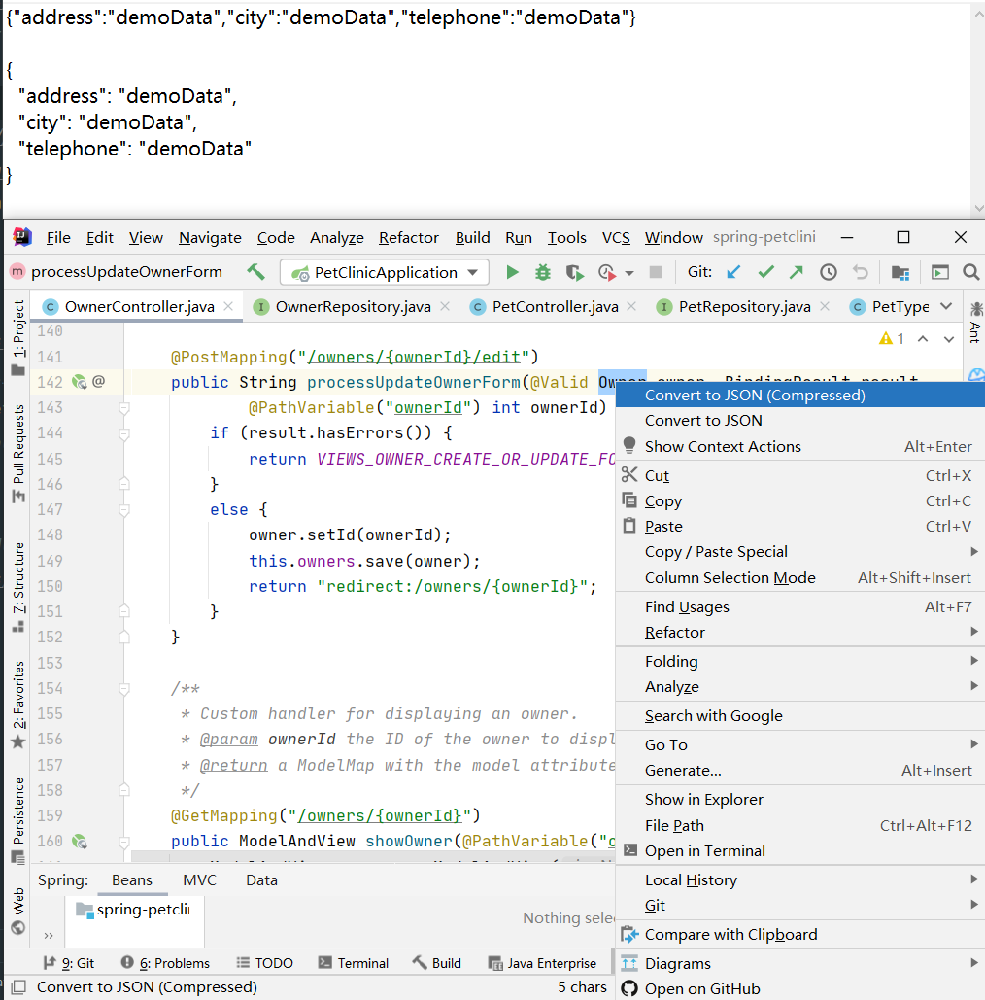

# Restful Toolkit For IntelliJ IDEA

[English](README.md)

## RestfulToolkitX?
因 [RestfulToolkit][RestfulToolkit] 作者已经没有维护，且不兼容最新的 IDEA 版本，基于它的其它版本也不兼容最新 IDEA， 故 Fork 之。
该分支后续会持续兼容最新的 IDEA 版本，也会加入一些实用特性。

---

## 功能及特性

- [x] 基于 [IntelliJ Platform Plugin Template][template] 重新构建。
- [x] 兼容 IDEA 2020.2及以上版本。
- [x] 支持 Java 及 Kotlin 语言,Spring framework (Spring Boot / Spring MVC),JAX-RS
- [x] 快捷搜索 REST URL 并直接定位到相应服务，比 IDEA 自带的 Search Anywhere 更快. ( 使用: Ctrl + \ 或 Ctrl + Alt + B ) 。
- [x] 一个导航窗口，用于显示 REST 服务的层次结构。
- [x] 一个简单的 HttpClient 工具。
- [x] 在请求方法上生成并复制参数，URL。
- [x] 将 Java类 转成 JSON; 格式化 JSON 数据 <em>( Windows: Ctrl + Enter; Mac: Command + Enter ) 。

快捷搜索 URL 预览

Restful 服务窗口预览

实用功能预览

## 安装

- IDE 插件安装:

  <kbd>Settings/Preferences</kbd> > <kbd>Plugins</kbd> > <kbd>Marketplace</kbd> > <kbd>搜索 "
  RestfulToolkitX"</kbd> >
  <kbd>安装插件</kbd>

- 手动安装:

  下载最新版 [latest release](https://github.com/huangbaihua001/restful-toolkit/releases/latest) 然后手动安装，操作入口:
  <kbd>Settings/Preferences</kbd> > <kbd>Plugins</kbd> > <kbd>⚙️</kbd> > <kbd>Install plugin from disk...</kbd>

## License

RestfulToolkitX is under the Apache 2.0 license. See the [Apache License 2.0](http://www.apache.org/licenses/LICENSE-2.0) file for details.

---
Plugin based on the [IntelliJ Platform Plugin Template][template]

[template]: https://github.com/JetBrains/intellij-platform-plugin-template

[RestfulToolkit]: https://github.com/mrmanzhaow/RestfulToolkit
